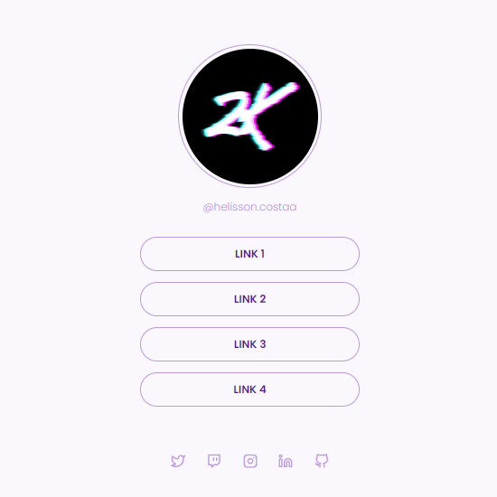

<h1 align="center"> Social Tree </h1>

## 💻 Sobre o projeto

Desafio criado pela rocketseat que consiste em criar uma página com uma lista de links que pode ser usada em perfis de redes sociais.  

 

  

## 🚀 Tecnologias

Esse projeto foi desenvolvido com as seguintes tecnologias:

- HTML
- CSS
- Figma
